# Yuxi Global - Angular Test

## 1. Introduction

In this test you will be asked to build a set of functionalities in Angular. You will be provided a set of **mockups** and a **base project** we have already setup for you in this repository. 

> We will review your submission following the evaluation criteria, make sure you don't miss it!

## 2. Challenge Definition

You must build the following interface using the base project:

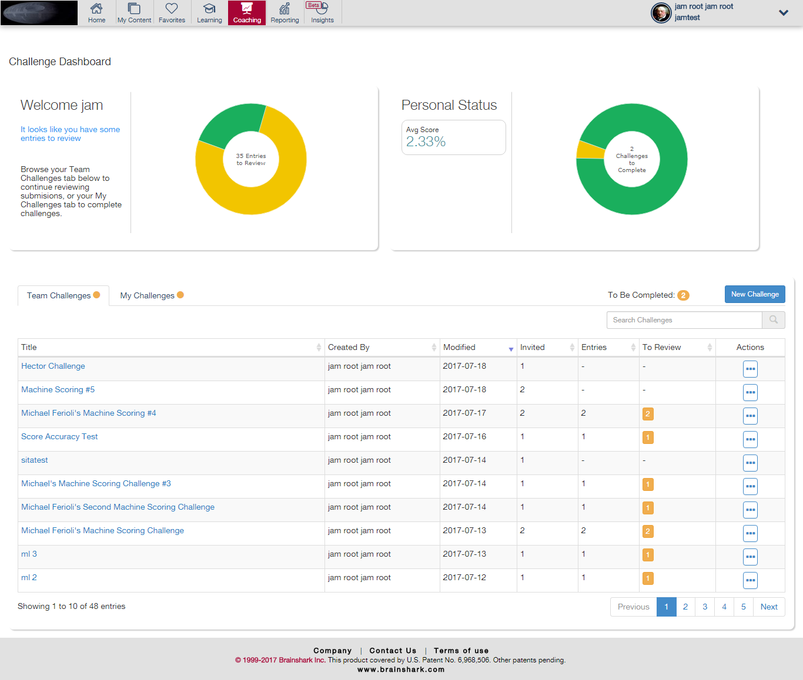

## 3. Data Layer

The data associated with the mockups is attached in this repository as `json` files. Take a look at the `assets/fake-data` folder. You must use the Angular HTTP Module to fetch the information from the `.json` files.

## 4. Base Project

The base project (you will use as starting point) is hosted in this repository and it's deployed [here](https://jdjuan.github.io/yuxi-global-angular-test/). The red square is where we want to see the functionality you build.

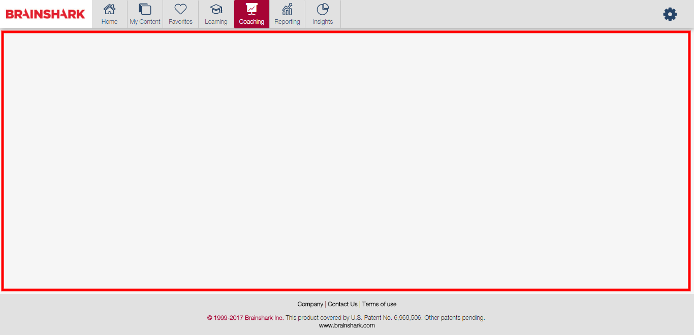

## 5. Evaluation Criteria

Category          | Percentage   |
:----------------:|:------------:|
|1. Creativity        |     50%      |
|2. Code Quality      |     30%      |
|3. Browser Support   |     20%      |

### 5.1 Creativity

We'd love to see if you are capable of coming up with a more usable and intuitive interface. A completely new looking version of the existing. Maybe you would get rid of the tabs, or perhaps the ellipsis. It's your call. Whatever that makes us say: "Wow!"

### 5.2 Code Quality

How readable, clean and modular is your code? Are you using the best practices?

### 5.3 Browser Support

We don't want to leave any browser behind, make sure your website renders correctly in Edge and IE11.

## 6. Setup your development environment

If you don't have a GitHub account, you must create one.

1. Fork this repository
2. Clone it in your local development environment
3. Run `npm install`
4. Run `npm start`
5. Now you should see [this](https://jdjuan.github.io/yuxi-global-angular-test/) in your local machine
6. You are all setup and ready to start

## 7. Delivery Conditions

Your solution should be delivered through the forked GitHub repository. It should meet the following conditions:

1. Make sure the repository is public so anyone can see the code.
2. We will clone your repository and test it locally, if your solution requires additional setup besides `$ npm install` and `$ npm start`, then make sure you state it in the `README.md` file.
3. Your solution should be deployed live so that we can also hit a URL and see it. We recommend you to use [GitHub pages](https://help.github.com/articles/configuring-a-publishing-source-for-github-pages/#publishing-your-github-pages-site-from-a-docs-folder-on-your-master-branch) but it is up to you.

> If deploying to GitHub pages remember to use the command: `ng build --prod --aot -bh ./`

## 8. Deadline

The solution must be submitted and uploaded in your repository before Tuesday, August 2nd at 11:59 a.m.

## 9. Additional Notes

This project was generated with [Angular CLI](https://github.com/angular/angular-cli) version 1.2.6.

### 9.1 Third-party libraries

You are free to use third-party libraries as long as you have a good reason for it.

---

# Data Layer

The following is a description of every single data shown in the interface 

## 1. Dashboard Summary

This holds general information for the whole application using graphics.

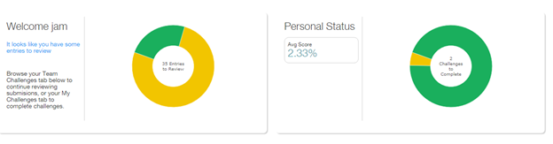

### 1.1 Entries to review

This is the result of calculating the sum of all the entries (`numberOfEntries`) of all the Team Challenges (`TeamChallenges.json`)

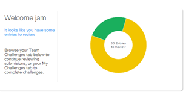

### 1.2 Personal Status

The **Average Score** is the average of every Overall Score (`overallScore` property ) of each of the completed (Challenges whose `completedDate` property is different than `null`) challenges from my challenges (`MyChallenges.json`).

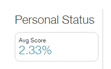

### 1.3 Challenges to Complete

The **Challenges to Complete** value is the number of all the challenges whose `completedDate` property is null.

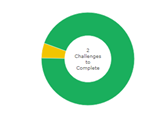

## 2. Team Challenges

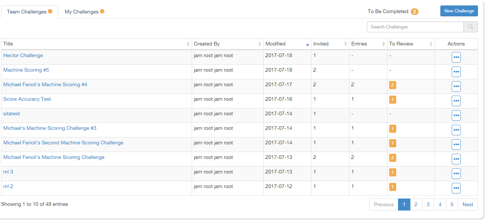

### 2.1 Invited

The `Invited` value can be taken from the `numberInvited` property.

### 2.2 Entries

The `Entries` value can be taken from the `numberOfEntries` property.

### 2.3 Pending to Review

The challenges **Pending to Review** are shown according to the property `numberToReview` which is present on each item of the `TeamChallenges.json`

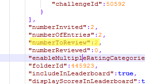
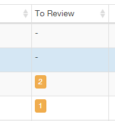

### 2.4 Ellipsis Button

The ellipsis button opens the following options. Don't worry, such buttons don't have any behavior:

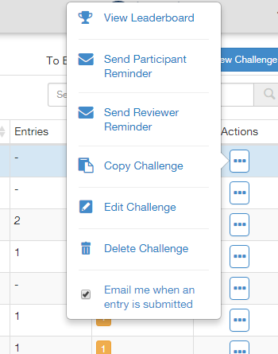

## 3. My Challenges

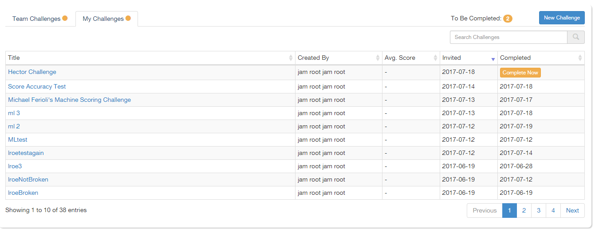

### 3.1 Created By

The `Created By` value can be taken from the `challengerFirstName` and `challengerLastName` properties.

### 3.2 Average Score

The `Average Score` value can be taken from the `overallScore` property.

### 3.3 Invited

The `Invited` value can be taken from the `modifiedDate` property.

### 3.4 Completed Challenges

**Challenges to be completed** can be calculated taking a look at the `completedDate` property. If it is `null`, then such challenge is still incomplete.

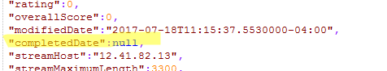
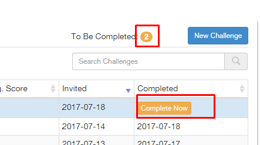

